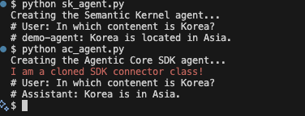

## Basic example of a shim SDK concept
We shim Semantic Kernel with our custom SDK called agentic_core
We do a simple and exemplary extension of the original SK SDK just printing out a new line in agentic_core/connectors/ai/open_ai.py.
Behaviour shown in the following image:

